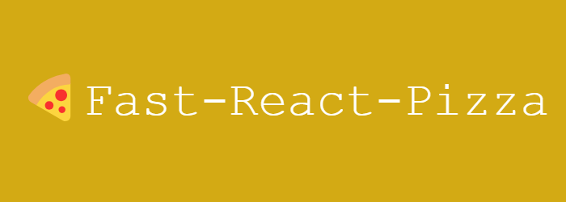
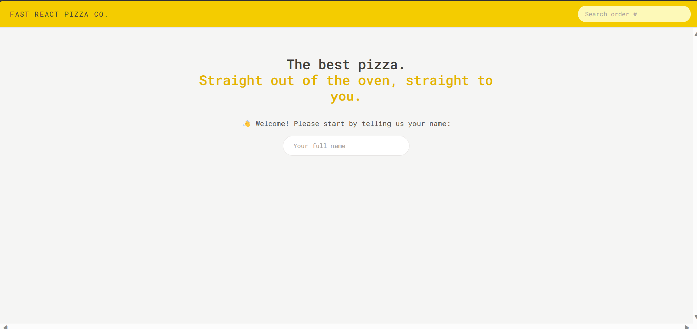
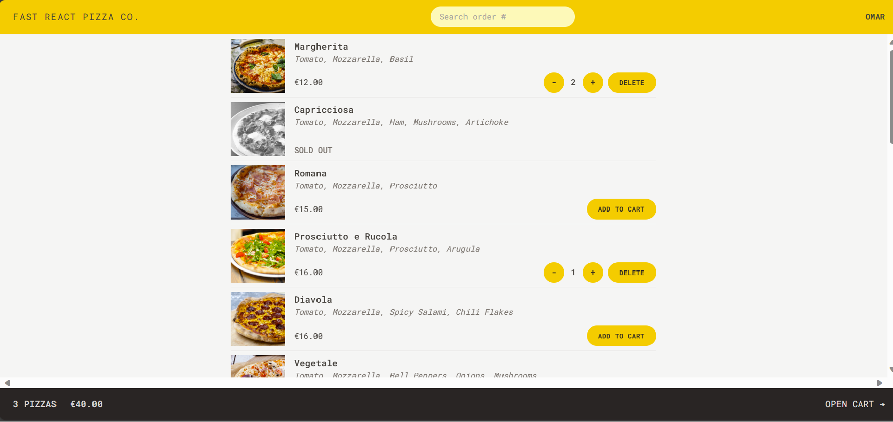
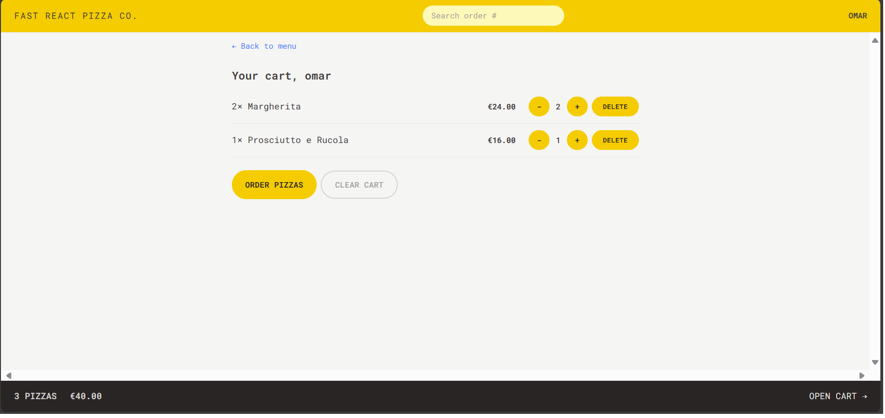
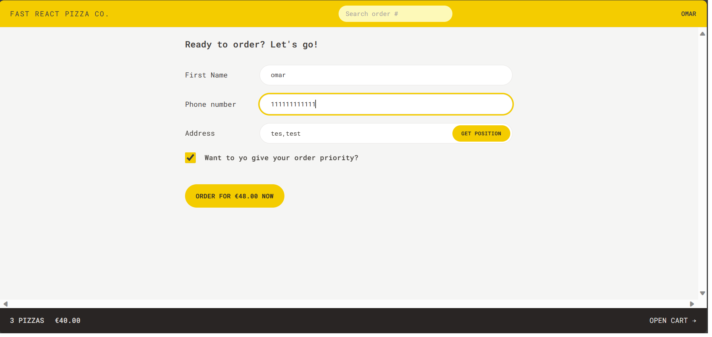
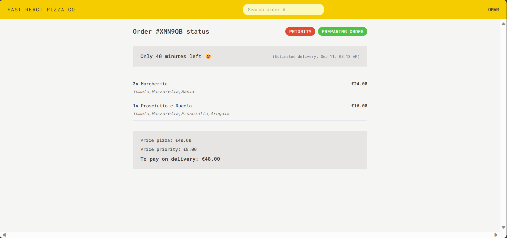

<div align="center">

<p align="center"></p>

</div>

## Description

- A simple web application called Fast React Pizza was created using React, Redux, TailwindCSS, Vite, and React Router. The major objective of this project is to make it possible for users to sign up and make pizza orders for delivery to their home. The application also gives users the option to enable geolocation for easier location access. The project has a number of important components, including Home, Cart Pages, Menus, Order, and User Pages.

## Technologies used

- React: A popular JavaScript library for building user interfaces.
- Redux: A state management library for managing the global state of the application.
- TailwindCSS: A utility-first CSS framework for creating responsive and modern UI components.
- Vite: A fast build tool for modern web development.
- React Router: A library for managing routing and navigation in a React application.

## Screenshots

<p align="center"></p>

<p align="center"></p>

<p align="center"></p>
<p align="center"></p>
<p align="center"></p>

<br/>

## 🛠️ Installation Steps:

<p>1. Clone the repository</p>

```
git clone https://github.com/OmarZahrah/react-pizza.git
```

<p>2. Install the required dependencies </p>

```
npm install
```

<p>3. Start the development server</p>

```
npm run dev
```

<br/>
